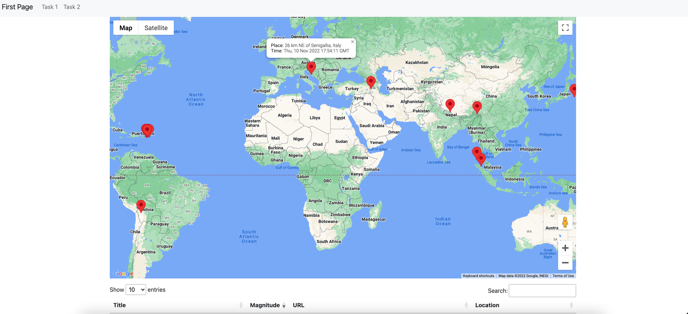

# Prerequisite
This project need to use composer for php autoload classes and NPM package manager for front end packages.

# Installation
1. Clone this repository
2. cd to the directory
3. run `composer install`  and `npm install`
4. Head towards `Database.php`, and change your local development settings. (i.e `LOCAL_PW`, `LOCAL_PORT`, and `DB_NAME`)
5. If you want to host in cloud servers, chnage `LIVE_PW`, `LIVE_PORT` as well.
6. You can toggle the development and live db by using `IS_LIVE` flag.
7. run `php -S localhost:8000`. and head towards `localhost:8000`. You will see the application. 
8. Alternatively, you can find this web application under following link: http://htunhtunhtet.me/. 

